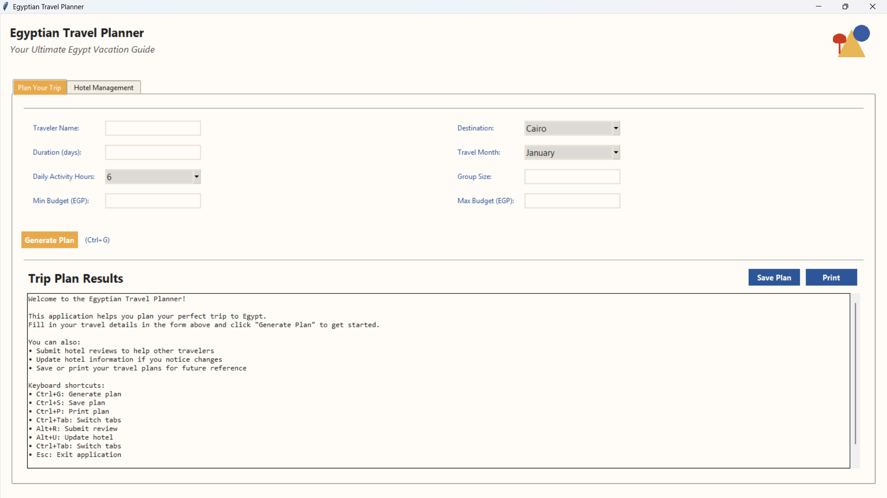
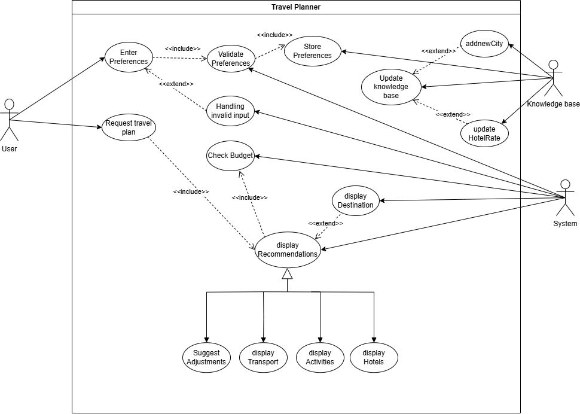
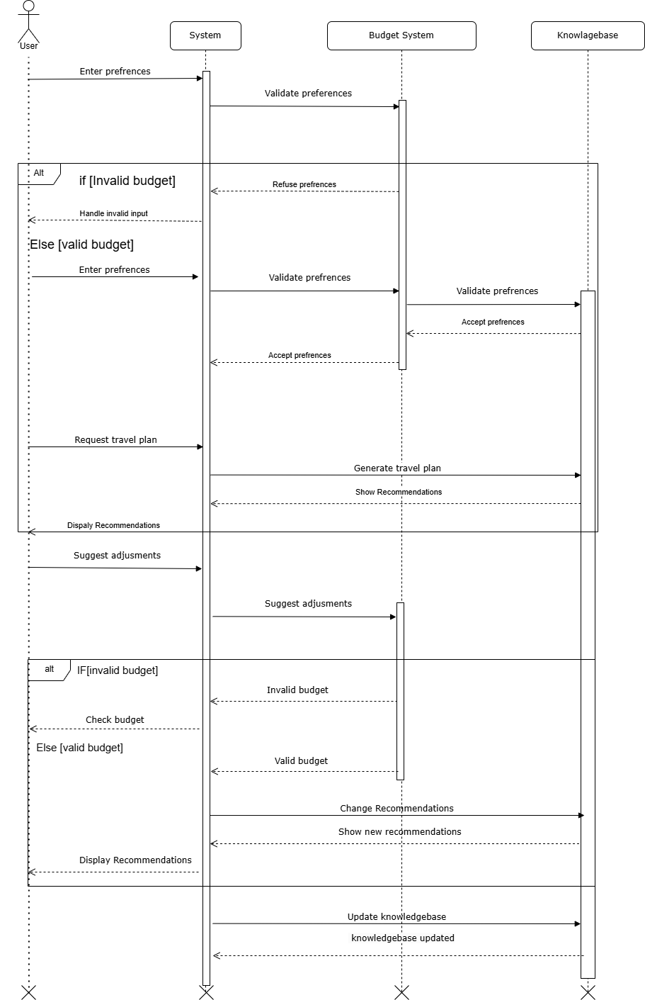
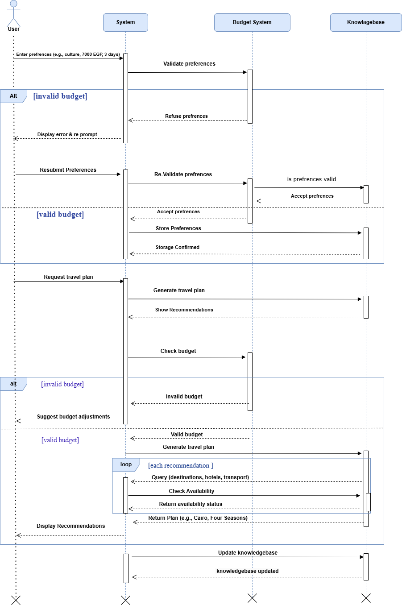
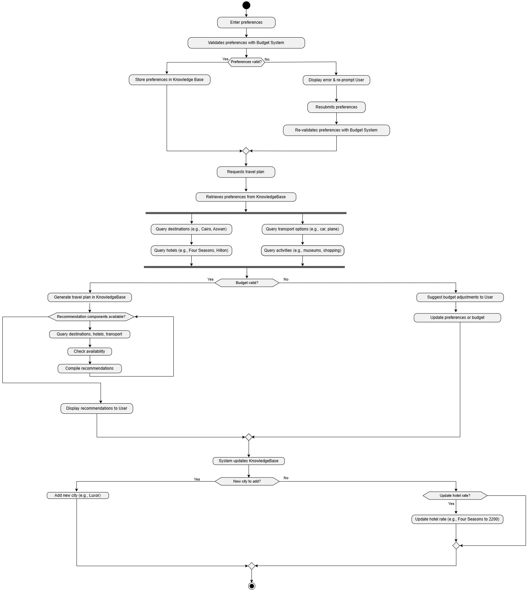

# Egyptian Travel Planner (Logic-based Travel Planner) 

[](https://www.python.org/downloads/)
[](https://www.swi-prolog.org/)
[](LICENSE)
  
  

A modern desktop application for planning your perfect Egyptian vacation. Using advanced AI techniques through Prolog, this app creates personalized travel itineraries based on your preferences.

**Welcome to the Logic-based Travel Planner**, an innovative solution leveraging **Prolog** to revolutionize travel planning with personalized, budget-friendly itineraries. Developed by the *TravelLogic Crew* for the *Logic Programming Course* at **Modern University for Technology & Information**, this project showcases modern logic programming techniques applied to real-world challenges.

 

---

## 🌟 Project Overview

The **Logic-based Travel Planner** automates travel planning by integrating **budget estimation**, **hotel recommendations**, **destination insights**, **transportation assistance**, and **activity discovery**. Built with **Prolog's declarative programming**, it offers a scalable, rule-based system that adapts to user preferences and constraints, transforming a traditionally tedious process into an efficient experience.

## ✨ Features

- 🗺️ **Smart Trip Planning**: Generate customized travel plans for major Egyptian cities
- 🏨 **Hotel Recommendations**: Get hotel suggestions based on your budget and preferences
- 🚗 **Transportation Options**: Find the best ways to get around at your destination
- 🏛️ **Activity Scheduling**: Discover the best attractions with optimized daily itineraries
- 💰 **Budget Management**: Keep your travel expenses within your specified budget
- 📝 **Hotel Reviews**: Submit and view hotel reviews to make informed decisions
- 💾 **Plan Saving**: Save and print your travel plans for offline reference

---

## 📋 Table of Contents

- [Problem Definition](#-problem-definition)
- [Project Description](#-project-description)
  - [Introduction](#-introduction)
  - [Technical Approach](#-technical-approach)
    - [System Components](#-system-components)
    - [Technical Features](#-technical-features)
    - [Design Principles](#-design-principles)
- [Installation](#-installation)
- [How to Use](#-how-to-use)
- [Diagrams](#-diagrams)
  - [Use Case Diagram](#-use-case-diagram)
  - [Sequence Diagram](#-sequence-diagram)
  - [Activity Diagram](#-activity-diagram)
- [Technical Details](#-technical-details)
- [Prolog Implementation](#-prolog-implementation)
- [Keyboard Shortcuts](#-keyboard-shortcuts)
- [Requirements](#-requirements)
- [Conclusion](#-conclusion)
- [References](#-references)
- [Contributing](#-contributing)
- [License](#-license)

---

## 🧩 Problem Definition

Before **logic-based systems** like *Prolog*, travel planning was a daunting task. Travelers struggled with **trustworthy recommendations**, **accurate budgeting**, and accessing **destination details** (e.g., landmarks, cultural sites). Upon arrival, challenges like selecting **budget-friendly hotels**, arranging **transportation**, and planning **activities** (e.g., shopping, cinema, museum tours) added complexity. The **Logic-based Travel Planner** addresses these pain points with an **automated**, *intelligent framework* that optimizes decision-making and enhances the travel experience.

---

## 📝 Project Description

### Introduction

The **Logic-based Travel Planner** redefines travel planning with **customized itineraries** powered by **Prolog**. Designed for the *Logic Programming Course*, it calculates **budgets**, recommends **hotels**, and provides **destination insights**, all while ensuring a *seamless* user experience. Future iterations will introduce a **GUI** and **real-time data integration**, aligning with modern travel tech trends.

### Technical Approach

A **rule-based expert system** built with **Prolog**, this project tackles the *complexity* of travel planning with precision and scalability.

#### System Components

- **Knowledge Base**:  
  - `city/1`: e.g., `cairo`, `aswan`, `PortSaid`.  
  - `attraction/2`: e.g., `attraction(cairo, pyramids)`.  
  - `hotel/4`: e.g., `hotel(cairo, 'four_seasons', 2000, 4.8)`.  
  - `transport/3`: e.g., `transport(cairo, car, 500)`.  
  - `activity/3`: e.g., `activity(cairo, shopping, 300)`.  
  - *Scalable* with modular design for future enhancements (e.g., user reviews).

- **Inference Engine**:  
  - Uses **Prolog's unification** and *backtracking* for efficient rule execution.

- **Interface Layer**:  
  - Modern **GUI** built with Python and Tkinter.

#### Technical Features

1. **Budget Estimation**: Aggregates costs (hotel, transport, food, activities).  
   - Example: `2000 * 3 + 500 + (300 * 3) = 6800 EGP` for a 3-day Cairo trip.
2. **Hotel Recommendations**: Filters `hotel/4` by budget and `Rating` (e.g., ≥ 4.2).
3. **Destination Information**: Queries `attraction/2` for landmarks and cultural sites.
4. **Transportation Assistance**: Matches `transport/3` to cities with cost optimization.
5. **Personalized Recommendations**: Uses `personalized_recommendation/4` for tailored plans.
6. **Activity Discovery**: Maps `activity/3` to user interests.

#### Design Principles

- **Modularity**: Independent facts and rules for easy updates.
- **Efficiency**: *Polynomial-time* performance via Prolog backtracking.
- **Scalability**: Ready for *real-time data* and *multi-user support*.
- **Reliability**: Robust input validation and constraint checking.

---

## 🚀 Installation

### Prerequisites

- Python 3.8+
- SWI-Prolog 8.0+
- Tkinter (usually included with Python)
- PIL (Pillow)
- PySwip (Python interface to SWI-Prolog)

### Setup Instructions

1. **Clone the repository**
   ```
   git clone https://github.com/HosamDyab/logic-based-travel-planner-prolog.git
   cd logic-based-travel-planner-prolog
   ```

2. **Install Python dependencies**
   ```
   pip install -r requirements.txt
   ```

3. **Ensure SWI-Prolog is installed**
   - Download from [SWI-Prolog website](https://www.swi-prolog.org/download/stable)
   - Make sure it's added to your system PATH

4. **Run the application**
   ```
   python travel_gui.py
   ```

---

## 📖 How to Use in SWI-Prolog


https://github.com/user-attachments/assets/5136ff88-eb35-47ee-9cf1-1804eb728a4e


### Planning a Trip

1. Fill in your travel details in the main form:
   - Your name
   - Destination city
   - Trip duration
   - Travel month
   - Daily activity hours
   - Group size
   - Budget range

2. Click "Generate Plan" or press Ctrl+G

3. Review your personalized travel plan, including:
   - Hotel recommendations
   - Transportation options
   - Daily activities with times and costs
   - Total budget breakdown

4. Save or print your plan using the buttons or keyboard shortcuts (Ctrl+S to save, Ctrl+P to print)

### Managing Hotels

Use the "Hotel Management" tab to:

- **Submit Reviews**: Share your experience at Egyptian hotels with ratings and comments
- **Update Hotel Information**: Update hotel data such as names and prices (admin feature)

---

## 📊 Diagrams

### Use Case Diagram

Visualizes the system's **functional requirements** and actor interactions.



- **Actors**: **User**, **System**, **Knowledge Base**.
- **Primary Use Cases**: **Enter Preferences**, **Request Travel Plan**, **Show Recommendations**, **Update Knowledge Base**.
- **Extended Use Cases**: **Handling Invalid Input**, **Suggest Adjustments**.

---

### Sequence Diagram

Depicts the **dynamic interactions** over time.


---

**Detailed Sequence Diagram**

Depicts the **dynamic interactions** over time.


- **Actors**: **User**, **System**, **Budget System**, **Knowledge Base**.
- **Flow**: Entering preferences, requesting plans, budget checking, and updates.
- **Controls**: `Alt` for invalid budgets, `Loop` for recommendations.
---

### Activity Diagram

Models the **procedural workflow**.



- **Flow**: From entering preferences to displaying recommendations, with budget validation and knowledge base updates.
- **Controls**: Decision points (e.g., "Budget valid?"), loops (e.g., query iterations).

---

## 🧠 Technical Details

The Egyptian Travel Planner uses a hybrid architecture:

- **Frontend**: Python with Tkinter for the graphical user interface
- **Backend**: SWI-Prolog for the logical reasoning and travel planning algorithms
- **Integration**: PySwip library to connect Python with Prolog

The application uses declarative logic programming to match travel preferences with available options and constraints.

---

## ⌨️ Keyboard Shortcuts

| Shortcut | Action |
|----------|--------|
| Ctrl+G   | Generate plan |
| Ctrl+S   | Save plan to file |
| Ctrl+P   | Print plan |
| Ctrl+Tab | Switch tabs |
| Alt+R    | Submit review |
| Alt+U    | Update hotel |
| Esc      | Exit application |

---

## 📋 Requirements

See [requirements.txt](requirements.txt) for a complete list of dependencies.

---

## 🎯 Conclusion
The Logic-based Travel Planner is a pioneering effort in logic programming, delivering a scalable, user-centric system. This project showcases Prolog's power in handling travel planning complexities, with diagrams illustrating its adaptability. Future plans include enhanced GUI features, real-time data, and multi-user support, positioning it as a leader in intelligent travel tech.

---

## 📚 References
- Booch, G., Rumbaugh, J., & Jacobson, I. (2005). The Unified Modeling Language User Guide (2nd ed.). Addison-Wesley.
- Bratko, I. (2012). Prolog Programming for Artificial Intelligence (4th ed.). Addison-Wesley.
- Object Management Group (OMG). (2023). UML Specification, Version 2.5.1. https://www.omg.org/spec/UML/2.5.1
- SWI-Prolog. (2023). Documentation. https://www.swi-prolog.org/
- Sommerville, I. (2015). Software Engineering (10th ed.). Pearson.

---

## 🤝 Contributing

Contributions are welcome! Please feel free to submit a Pull Request.

---

## 📄 License

This project is licensed under the MIT License - see the [LICENSE](LICENSE) file for details.


*Happy Travels!* 🐪✨
